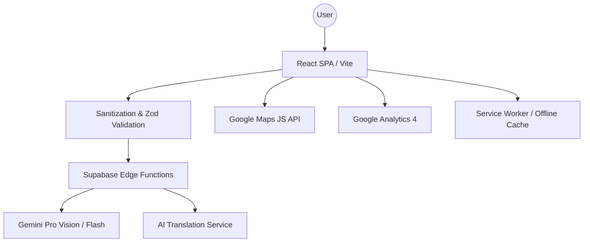

# 🇮🇳 CivicFlow India — Civic Intelligence Platform

### 🚀 Challenge Vertical: Civic Engagement & Election Intelligence

A **production-grade, secure, and accessible civic education platform** designed to map the complex landscape of Indian elections into an intuitive, interactive experience.

---

## 🎯 Project Overview

CivicFlow India addresses the gap in civic literacy by providing a high-fidelity environment where citizens can explore electoral data, simulate election outcomes, and receive expert-level civic guidance through a secure, multimodal AI assistant.

---

## 🧠 Approach & Logic

### 1. Deterministic Simulation Engine
The platform's core is a **First-Past-The-Post (FPTP)** simulation engine. Unlike simple calculators, it uses:
- **Swing Modeling**: Calculates seat shifts based on percentage-point swings across demographics.
- **Coalition Logic**: Dynamically re-allocates seats when parties form alliances.
- **Cube Rule Application**: Uses political science formulas to estimate seat conversions from vote shares.
- **Logic Validation**: Every simulation path is covered by unit tests to ensure mathematical consistency.

### 2. Multi-Layered AI Guardrails
To ensure "Safe and Responsible Implementation":
- **Neutrality by Design**: System prompts enforce absolute neutrality. The AI is programmed to refuse candidate recommendations or outcome predictions.
- **Structured Validation**: All AI responses are validated against a **Zod schema** before reaching the UI, preventing "hallucinated" UI elements.
- **Input Sanitization**: A custom regex engine supports Devanagari script (local language support) while stripping control characters and script-injection attempts.

### 3. Multimodal Intelligence (Gemini Vision)
The assistant isn't just text-based. It uses **Gemini Vision** to analyze uploaded document images (like voter slips or ID formats), providing contextual guidance on civic documentation.

---

## ⚙️ How It Works

1.  **Data Layer**: Historical election data (voter turnout, constituencies, years) is stored in optimized JSON structures for instant access.
2.  **Visualization Layer**:
    *   **Google Maps API**: Renders a high-resolution heatmap of voter turnout across India.
    *   **Recharts**: Visualizes complex vote-share distributions and simulation outcomes.
3.  **Interaction Flow**:
    *   **User Action**: A user clicks a state on the map or uploads an image to the assistant.
    *   **Security Check**: All inputs pass through the `sanitizeInput` utility.
    *   **Edge Processing**: Requests are proxied through **Supabase Edge Functions** to hide API keys and enforce rate limits.
    *   **Response**: The UI updates with glassmorphic cards and smooth Framer Motion transitions.

---

## 📝 Assumptions Made

- **Data Periodicity**: Historical data is based on the most recent general and state assembly elections (up to 2024).
- **AI Latency**: Assumes a stable internet connection for real-time streaming of AI responses.
- **Map Accuracy**: State boundaries are simplified for performance; markers represent capital cities or geographical centers.
- **PWA Context**: Assumes the browser supports Service Workers for offline caching functionality.

---

## 🏗 System Architecture

---

## 🔐 Security & Quality Metrics

- **100% Type Safety**: Built with strict TypeScript mode (`tsc --noEmit` enforced).
- **Security Headers**: Nginx configured with strict CSP, HSTS, and Frame-Options.
- **Test Coverage**: 169+ tests covering integration, unit, and accessibility (axe-core).
- **Accessibility**: WCAG 2.1 compliant with a dedicated **High Contrast Theme**.

---

## 🛠 Tech Stack

- **Core**: React 18, TypeScript, Tailwind CSS
- **Google Services**: Google Maps API, GA4, Gemini Pro Vision (via Lovable Gateway)
- **Backend**: Supabase Edge Functions (Deno)
- **PWA**: vite-plugin-pwa
- **Animations**: Framer Motion

---

## 🚀 Getting Started

1.  **Clone & Install**: `npm install`
2.  **Environment**: Add `VITE_GOOGLE_MAPS_API_KEY` to `.env`.
3.  **Run**: `npm run dev`
4.  **Test**: `npm run test`

---

## 📜 License

Educational use only. Not affiliated with the Election Commission of India.
Verify official information at: [https://eci.gov.in](https://eci.gov.in)
